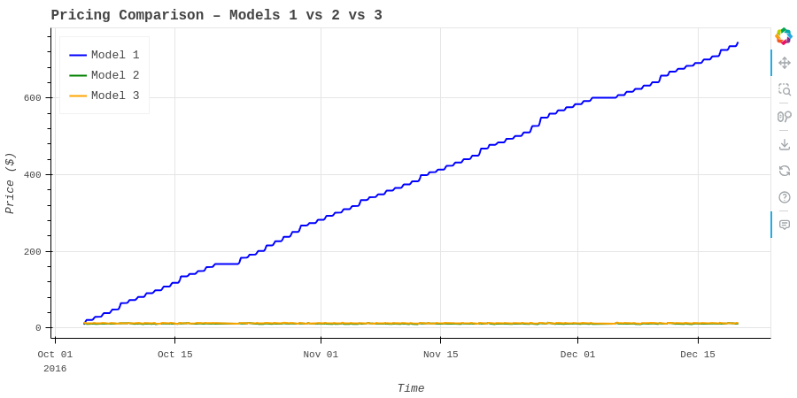
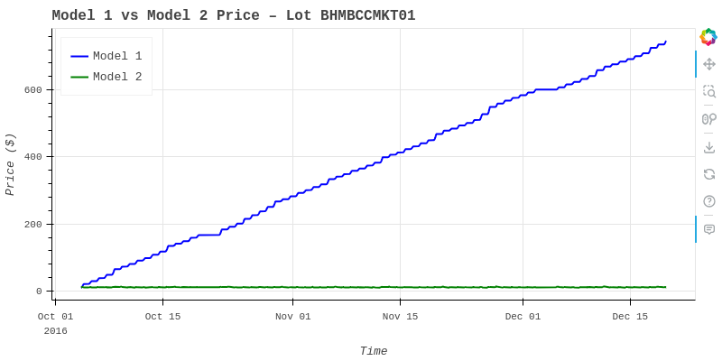

# 🅿️ Dynamic Pricing for Urban Parking Lots  
Capstone project for Summer Analytics 2025 – IIT Guwahati

## 🎯 Project Objective

This project presents a dynamic pricing framework for urban parking lots using real-time data. The objective is to optimize parking prices based on factors such as:

- Lot occupancy
- Queue length
- Nearby traffic conditions
- Vehicle type
- Local market competition

The goal is to reduce congestion, increase operational revenue, and enhance user satisfaction by deploying adaptive, intelligent pricing mechanisms.

---

## 🧠 Models Implemented

| 🔢 Model | 📋 Description |
|---------|----------------|
| **Model 1: Linear Occupancy-Based Pricing** | Increases price linearly with occupancy percentage. Simple but limited in context awareness. |
| **Model 2: Multi-Factor Demand-Based Pricing** | Factors in occupancy, traffic, queue length, vehicle type, and special events to estimate demand and price dynamically. |
| **Model 3: Competitor-Aware Pricing** | Adjusts price based on nearby lot prices and availability using geospatial comparisons. |

---

## 🧪 Real-Time Implementation (Experimental)

- Implemented with the **Pathway** stream processing library.
- Ingests live or simulated data streams and applies pricing logic in real-time.
- Outputs intermediate results to a JSONL file.
- Due to limitations in Google Colab, real-time output rendering was not finalized.

---

## 📁 Project Structure

dynamic-parking-pricing/  
├── dynamic_parking.ipynb            # Google Colab notebook with all models  
├── Final_Report.md                  # Polished project write-up  
├── visualisation/                   # Folder containing exported plots  
│   ├── model1_price_plot.png        # Static plot – Model 1  
│   ├── model1_vs_model2_plot.png    # Static plot – Model 1 vs Model 2  
│   ├── final_model_comparison.png   # Static plot – All 3 models  
└── README.md                        # This file

---

## 📊 Visualizations

All model outputs and comparisons are visualized using the Bokeh library.

### 🔹 Model 1 – Price Over Time

### 🔸 Model 1 vs Model 2 – Comparative Pricing

### 🔺 Final Comparison – Models 1, 2 & 3

---

## 🔍 Key Insights

- Simple occupancy-based pricing (Model 1) performs poorly under complex demand conditions.
- Multi-factor pricing (Model 2) adapts better to real-world fluctuations.
- Competitor-aware pricing (Model 3) intelligently adjusts rates based on nearby alternatives.
- External events (e.g. festivals, traffic jams) significantly affect parking demand.

---

## 📝 How to Use This Project

- 📥 Download or clone this repository.
- 📘 Open `Dynamic_Pricing_Urban_Parking_SA2025(1).ipynb` in Google Colab or Jupyter Notebook.
- ▶️ Run all cells to view model outputs and interactive visualizations.
- 📸 Exported `.png` images of key plots are included for quick preview.

---

> 🚗 Built with Python, Bokeh & Smart Thinking — for smarter urban mobility 🚦

